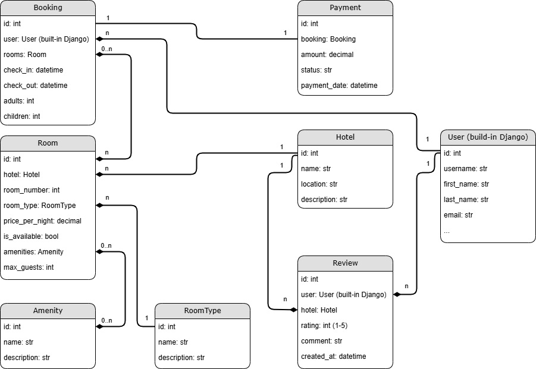
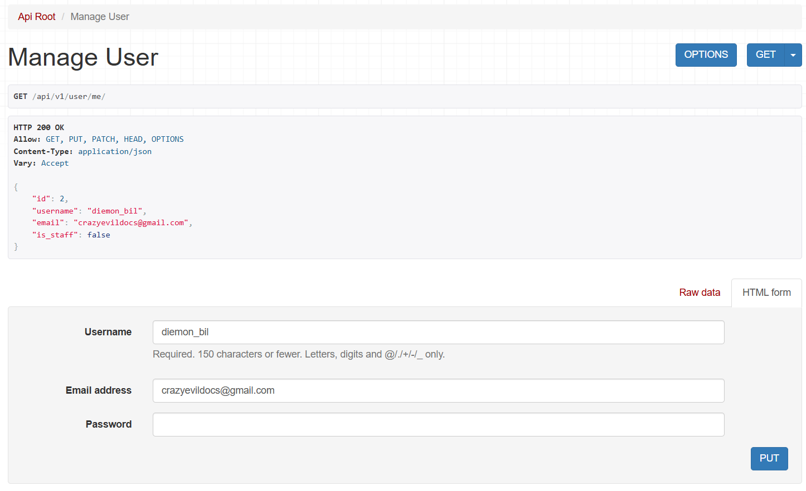
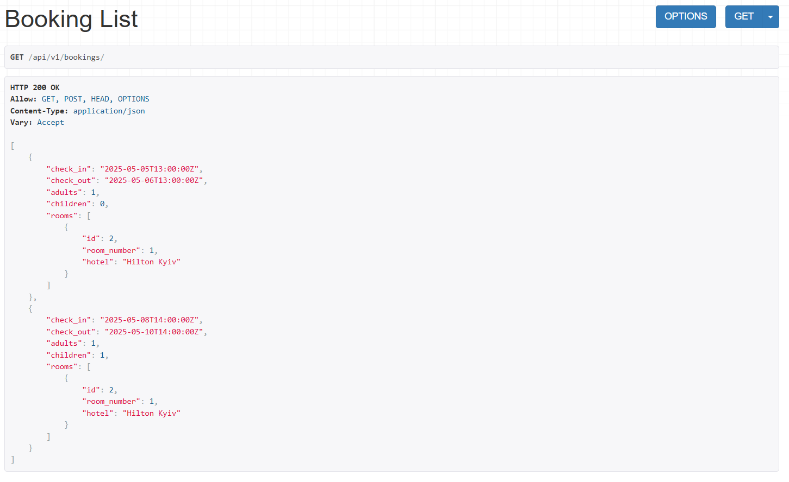
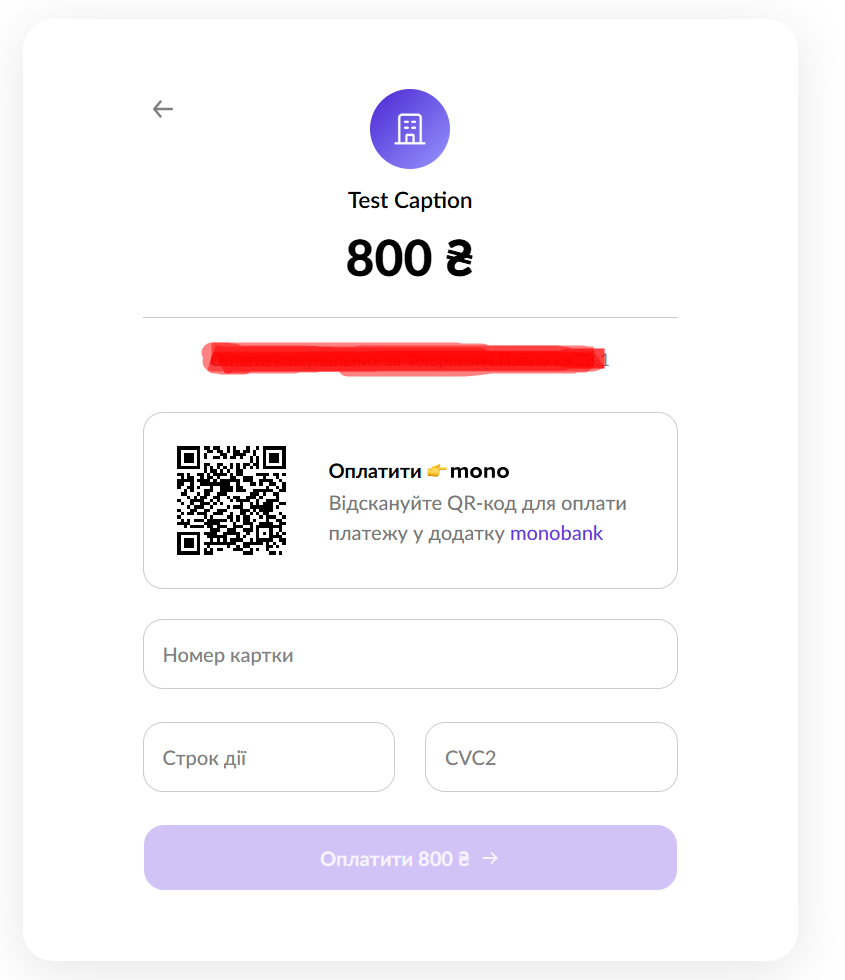
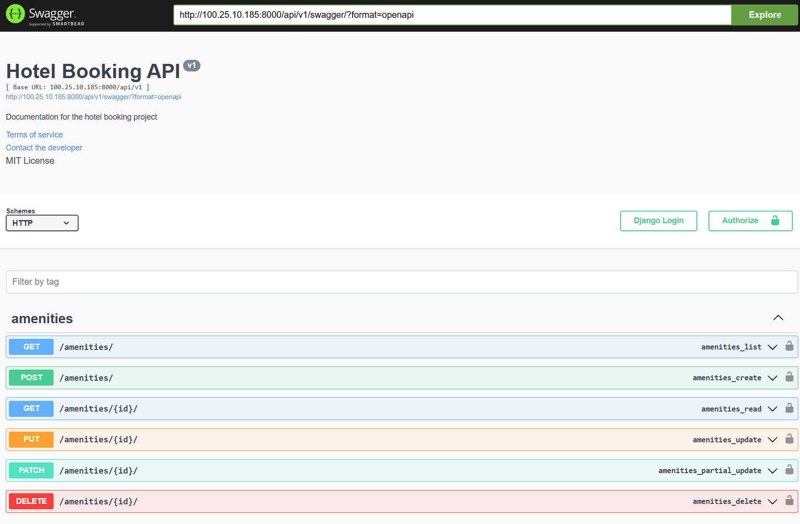

# 🏨 HotelBookingAPI

**HotelBookingAPI** is a RESTful API for managing hotel bookings, built with Django and Django REST Framework. It supports functionalities such as hotel listings, room management, bookings, reviews, and amenities — with real payment integration for production use. The project is containerized using Docker and deployed on **Amazon Web Services (AWS)**.

---

## 🌐 Live Deployment

The project is deployed on **AWS**. http://100.25.10.185:8000/api/v1/

---

## 🧰 Tech Stack

- **Backend**: Python 3.11, Django 5.2, Django REST Framework
- **Authentication**: JWT (via SimpleJWT)
- **Database**: Remote PostgreSQL on AWS
- **Containerization**: Docker
- **Payments**: Monobank API integration (real production-ready)
- **Role-based access**: separate permissions for unauthenticated users, regular authenticated users, and administrators
- **Static Files Management**: WhiteNoise
- **API Documentation**: Swagger (via drf-yasg)

---

## 🖥️ Local Setup

### 1. Clone the Repository

```bash
git clone https://github.com/diemonBil/HotelBookingAPI.git
cd HotelBookingAPI
```

### 2. Create a `.env` File

Create a `.env` file in the root directory with the following content:

```env
DEBUG=True
DJANGO_SECRET_KEY=your-secret-key
ALLOWED_HOSTS=127.0.0.1,localhost
DB_NAME=your-db-name
DB_USER=your-db-user
DB_PASSWORD=your-db-password
DB_HOST=your-db-host
DB_PORT=your-db-port
MONOBANK_TOKEN=your-monobank-token
```

### 3. Build and Run with Docker

```bash
docker build -t hotel-booking-api .
docker run -p 8000:8000 hotel-booking-api
```

The API will be accessible at: [http://localhost:8000/api/v1](http://localhost:8000/api/v1)

To register use [http://localhost:8000/api/v1/user/register](http://localhost:8000/api/v1/user/register)

---

## ⚙️ Database Migrations & Static Files

If running inside the container manually:

```bash
python manage.py migrate
python manage.py collectstatic --noinput
```

## 💳 Payment Integration

This project integrates a **real payment system** using the Monobank API.  
It supports secure transactions for hotel bookings, and simulates real-world financial workflows.

> Note: A valid Monobank token is required in the `.env` file to enable payment functionality.

---

## 🔐 Authentication & Authorization

The project uses JWT tokens for secure authentication and supports **role-based access control (RBAC)**:

- **Unauthenticated users** can register and login
- **Authenticated users** can make bookings, write reviews, and manage their profile
- **Admins** have full access to manage hotels, rooms, bookings, payments, amenities and users

---

## 📘 API Documentation

Swagger UI is available at:
```
GET api/v1/swagger/
```

---

## 📂 Project Structure

```
hotel/           # Hotel, room, booking, review, amenity, payment logic
user/            # Custom user model and authentication
HotelBookingAPI/ # Django project configuration
```

---

## 📦 Deployment Notes

- Static files are collected using Django's `collectstatic` command.
- WhiteNoise is used to serve static files in production, eliminating the need for an external web server like Nginx.
- The Docker image includes all necessary production optimizations.

---

## 🖼️ Screenshots

### 📊️ Database Schema


### 👤 User Me endpoint


### 🛏 Bookings list


### ✅ Monobank Payment


### 📘 Swagger UI
